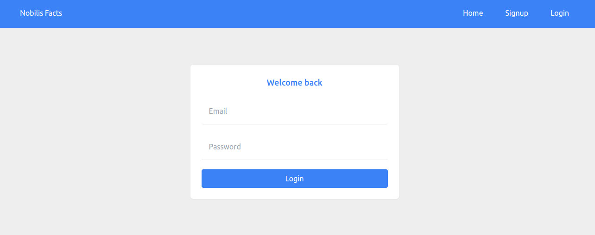
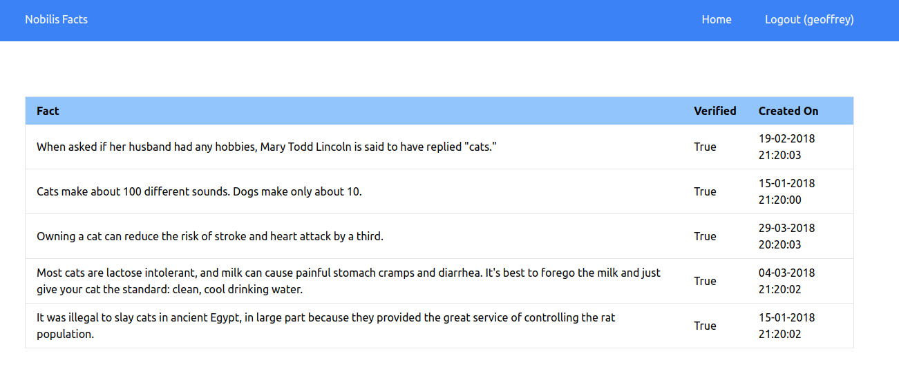
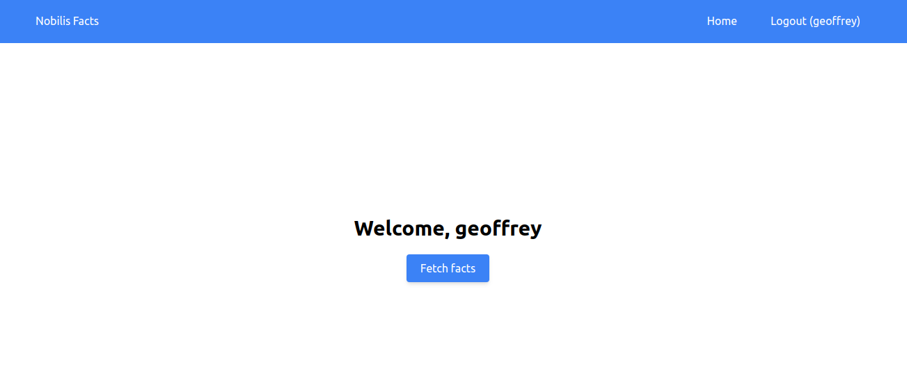

# Nobilis Facts

## Introduction

Nobilis Facts is a simple web application that allows users login, and view a list of facts from https://cat-fact.herokuapp.com/facts. It uses the following technologies:

- React
- Context API
- React Router
- Axios
- Tailwind CSS
- Rails API

It fetches data from Rails API. The API is hosted on Render and can be accessed via this github link: https://github.com/geoffreykithuku/nobilis-back

## Screenshots

1. Login Page
   

2. Facts Page
   

3. Home Page

## Live Demo

[Live Demo Link](https://nobilis-facts.vercel.app/)
